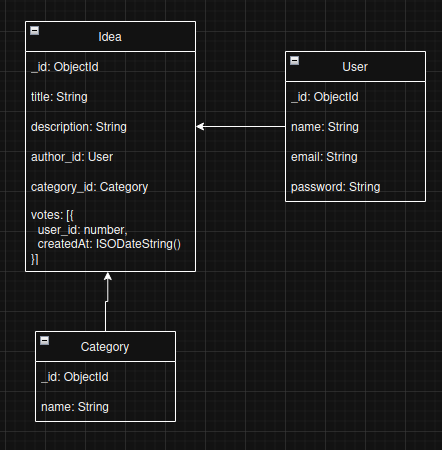

# 🧠 Plataforma de Ideias - MVP

Uma aplicação colaborativa para compartilhar e votar em ideias, construída com **Node.js**, **Express**, **MongoDB** e **Handlebars**.

---

## 🗺️ Modelagem do Banco de Dados

A modelagem do banco foi feita para representar as entidades principais do sistema: **Usuário**, **Ideia** e **Categoria**.

<p align="center">
  
</p>

### 🔹 Entidades e Relacionamentos

#### 🧍‍♀️ User
Representa o usuário autenticado no sistema.
- `name`: nome do usuário  
- `email`: único e obrigatório  
- `password`: armazenado com hash (bcrypt)  
- `type`: define o papel (`user` ou `admin`)  
- Relacionamentos:
  - Pode **criar** várias ideias (`Idea`)
  - Pode **votar** em ideias (armazenado em `Idea.voters`)

#### 💡 Idea
Representa uma ideia criada pelos usuários.
- `title`: título da ideia  
- `description`: descrição detalhada  
- `votesCount`: total de votos  
- `voters`: lista de usuários que votaram  
- `author`: referência para `User`  
- `category`: referência para `Category`  

#### 🏷️ Category
Classifica ideias por temas.
- `name`: nome da categoria  
- `color`: cor para exibição na interface  

---

## ⚙️ Instalação

1. **Clonar o repositório:**
   ```bash
   git clone <repo>
   cd plataforma-ideias
   ````

2. **Instalar dependências:**

   ```bash
   npm install
   ```

3. **Configurar variáveis de ambiente:**
   Copiar `.env.example` → `.env` e ajustar:

   ```
   MONGODB_URI=mongodb://localhost:27017/plataforma
   SESSION_SECRET=algumseguro
   ```

4. **Popular o banco com categorias iniciais:**

   ```bash
   node config/seedCategories.js
   ```

5. **Rodar o servidor:**

   ```bash
   npm start
   ```

---

## 🧩 Estrutura de Rotas

### 🔐 Auth (`routes/auth.js`)

| Método | Rota        | Descrição                      |
| ------ | ----------- | ------------------------------ |
| GET    | `/register` | Exibe o formulário de cadastro |
| POST   | `/register` | Cria um novo usuário           |
| GET    | `/login`    | Exibe o formulário de login    |
| POST   | `/login`    | Realiza autenticação           |
| POST   | `/logout`   | Finaliza a sessão              |

---

### 🏷️ Category (`routes/category.js`)

| Método | Rota | Descrição                             |
| ------ | ---- | ------------------------------------- |
| GET    | `/`  | Lista todas as categorias cadastradas |

---

### 💡 Ideas (`routes/ideas.js`)

| Método | Rota        | Descrição                                       |
| ------ | ----------- | ----------------------------------------------- |
| GET    | `/`         | Lista todas as ideias                           |
| GET    | `/new`      | Exibe formulário de criação (login obrigatório) |
| POST   | `/`         | Salva nova ideia                                |
| GET    | `/:id/edit` | Edita uma ideia (somente o autor)               |
| PUT    | `/:id`      | Atualiza ideia existente                        |
| DELETE | `/:id`      | Remove ideia (somente o autor)                  |
| POST   | `/:id/vote` | Registra voto (somente não autores)             |
| GET    | `/:id`      | Exibe detalhes da ideia                         |

---

### Descrição do fluxo:

1. O **usuário** acessa `/register` ou `/login` para autenticar.
2. Após logado, pode **criar novas ideias** ou **votar** em ideias de outros.
3. Cada ideia pertence a uma **categoria** e exibe o **total de votos**.
4. Apenas o **autor** pode editar ou excluir sua própria ideia.
5. O sistema mantém sessões e protege as rotas com middlewares de autenticação.

---

## 🧰 Tecnologias e Bibliotecas

* **Backend:** Node.js + Express
* **Banco:** MongoDB (Mongoose ODM)
* **Autenticação:** bcrypt + express-session
* **Segurança:** helmet, csurf, express-async-errors
* **Validação:** express-validator
* **Template Engine:** Handlebars
* **Estilo:** CSS modularizado em `/public/css`

---

## 🧾 Recursos Implementados

✅ Autenticação com **bcrypt + sessions**
✅ **CRUD de ideias** (somente autor pode editar/remover)
✅ **Voto único** por usuário (validação no backend)
✅ **Listagem ordenada** por votos
✅ Proteções de segurança
✅ Feedback ao usuário com **flash messages**

---

## 📦 Scripts Úteis

```bash     
node config/seedCategories.js  # Popula categorias iniciais
npm start  # Executa aplicação
```

---

## 👩‍💻 Autoria

Desenvolvido como MVP da **Plataforma de Ideias** — um espaço para propor, compartilhar e apoiar novas ideias colaborativas.

```